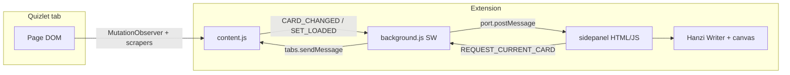

# VisualQuizlet

A **Chrome extension** for practicing **Chinese character writing** alongside **Quizlet** flashcards. As you flip through a deck on Quizlet, a **side panel** shows a drawing canvas where you write each character **stroke-by-stroke** with immediate feedback—aligned with how Hanzi are traditionally learned (stroke order and shape), not generic “computer vision” from a photo of your sketch.

---

## Features

- **Real-time sync** — The side panel reacts to the **currently visible** flashcard on Quizlet (DOM changes + debounced updates).
- **Stroke-by-stroke validation** — Powered by [Hanzi Writer](https://hanziwriter.org/) and its stroke data (9,000+ common characters).
- **Rice grid (米字格)** — A centered practice box with horizontal, vertical, and diagonal guides.
- **Multi-character terms** — Each CJK character in a term is quizzed **one after another** in the same side panel session.
- **Hints** — “Show Strokes” plays the correct stroke order; optional outline helps beginners.
- **Session stats** — Streak, cards completed, and mistakes (persisted briefly in `chrome.storage.local`).

---

## Tech stack

| Layer | Choice | Why |
|--------|--------|-----|
| **Platform** | Chrome **Manifest V3** | Side Panel API, service worker background, modern extension model. |
| **UI** | **HTML + CSS + vanilla JavaScript** | No build step; small surface area; easy to load unpacked. |
| **Writing practice** | **Hanzi Writer** (`lib/hanzi-writer.min.js`) | Client-side stroke templates and quiz logic; no OCR API keys. |
| **Character geometry** | **hanzi-writer-data** (via CDN) | Per-character JSON loaded on demand so the repo stays small. |
| **Quizlet integration** | **Content script** on `*://*.quizlet.com/*` | Reads the live page; resilient to partial DOM changes via multiple selector strategies + optional embedded JSON scrape. |
| **Cross-context messaging** | `chrome.runtime` **messages** + **long-lived port** (`sidepanel`) | Service worker relays tab → panel; panel can request a fresh snapshot. |
| **Persistence** | `chrome.storage.local` | Session object (`vqSession`) with a time-based reset (see `sidepanel.js`). |

**Chrome APIs in use:** `sidePanel`, `tabs`, `activeTab`, `storage`, `runtime` (connect / sendMessage), content scripts.

**External network:** `https://cdn.jsdelivr.net/*` is declared in `host_permissions` so the side panel can `fetch()` Hanzi Writer character JSON.

---

## Architecture & design

### High-level diagram



### Responsibilities

1. **`content.js` (content script)**  
   - Runs on Quizlet after `document_idle`.  
   - Observes `document.body` with **`MutationObserver`** (debounced ~150ms) so flips and navigation don’t spam updates.  
   - Derives **visible card text** with several fallbacks (flashcard faces, formatted text regions, “large text” heuristic).  
   - Builds **`CARD_CHANGED`** payloads: classifies **Chinese vs non-Chinese** with CJK regex, optionally matches against a scraped term list or embedded JSON.  
   - Emits **`SET_LOADED`** when the full term list is available on set pages (for counts / progress context).

2. **`background.js` (service worker)**  
   - **`chrome.sidePanel.setPanelBehavior({ openPanelOnActionClick: true })`** so the toolbar icon opens the panel.  
   - Holds a reference to the **`sidepanel` port**; when connected, asks the active tab to **`REQUEST_CURRENT_CARD`**.  
   - **Bridges** `chrome.runtime.sendMessage` from the content script to **`port.postMessage`** for the side panel (the panel is not a normal message target for arbitrary senders).  
   - Forwards **`REQUEST_*`** messages from the panel to the **active tab’s** content script.

3. **`sidepanel/` (UI + quiz controller)**  
   - Connects with **`chrome.runtime.connect({ name: 'sidepanel' })`**.  
   - On **`CARD_CHANGED`**, tears down the previous `HanziWriter` instance, extracts CJK code points from the target string, and runs **`quiz()`** per character.  
   - Uses a **custom `charDataLoader`** that fetches JSON from jsDelivr for each character.  
   - **States:** waiting (no Quizlet), drawing, complete (per card), no-Chinese / unsupported cases.

### Design choices (intentional)

| Decision | Rationale |
|----------|-----------|
| **Side panel vs popup** | Stays open while you use Quizlet; doesn’t block the flashcard UI. |
| **Hanzi Writer vs “CV / OCR”** | Stroke-order feedback is **deterministic** and **pedagogically aligned** with Chinese; freeform bitmap recognition needs heavy models or paid APIs and is weaker on stroke order. |
| **Debounced observer** | Quizlet animates flips; debouncing reduces flicker and duplicate events. |
| **Multiple DOM strategies** | Quizlet’s React class names change; fallbacks reduce breakage across redesigns. |
| **CDN character data** | Keeps the extension small; first draw of a new character may require network. |

---

## Project structure

```
visualquizlet/
├── manifest.json           # MV3: permissions, host_permissions, content_scripts, side_panel
├── background.js           # Service worker: port relay, tab messaging, side panel behavior
├── content.js              # Quizlet DOM observer + card / set scraping
├── lib/
│   └── hanzi-writer.min.js # Hanzi Writer runtime (bundled)
├── sidepanel/
│   ├── sidepanel.html      # Panel markup + script order
│   ├── sidepanel.css       # Layout, rice grid, states, micro-animations
│   └── sidepanel.js        # Port listener, HanziWriter lifecycle, storage session
├── icons/                  # Toolbar / store icons (16, 48, 128)
├── README.md
└── .gitignore
```

### Message flow (conceptual)

| Direction | Type / name | Purpose |
|-----------|-------------|---------|
| Content → Background | `CARD_CHANGED` | Current card’s Chinese + definition (+ metadata). |
| Content → Background | `SET_LOADED` | Full term list and count when detectable. |
| Background → Side panel | same objects via `port.postMessage` | Keep panel in sync with the tab. |
| Side panel → Background → Content | `REQUEST_CURRENT_CARD` | Force re-read after panel opens or tab switch. |
| Side panel → Background → Content | `REQUEST_ALL_TERMS` | Optional bulk terms (if used). |

---

## Installation

1. Clone or download this repository.
2. Open Chrome → **`chrome://extensions`**.
3. Enable **Developer mode** (top right).
4. **Load unpacked** → select the folder that contains **`manifest.json`** (`visualquizlet/`).
5. Open a Quizlet set with Chinese on one side and pinyin/English on the other.
6. Click the **VisualQuizlet** toolbar icon to open the **side panel**.

After editing code, use **Reload** on the extension card on `chrome://extensions`.

---

## Usage

1. Open a Quizlet set (e.g. `https://quizlet.com/.../...`).
2. Open **flashcards** (or any mode where a single card’s text updates in the DOM as you flip).
3. Open the **side panel** from the extension icon.
4. The prompt shows the **non-Chinese side** (pinyin / English) when available; draw the **Chinese** in the canvas.
5. Use **Show Strokes**, **Reset**, **Skip**, and **Show outline** as needed.
6. When the quiz finishes for that card, **flip on Quizlet** to verify, then move to the next card—the panel should follow.

**Requirements:** Network access for **first-time** load of each character’s JSON from jsDelivr (unless you later bundle or self-host `hanzi-writer-data`).

---

## Limitations & troubleshooting

- **Quizlet DOM changes** — Selectors may need updates if Quizlet ships a breaking UI; the content script uses several strategies to stay working longer.
- **Rare characters** — If a character is missing from Hanzi Writer’s dataset, that glyph may be skipped or show a fallback path (see `sidepanel.js` / `onCharNotFound`).
- **“Not connected”** — Open a `quizlet.com` tab and reload the page or click **Check for Quizlet Page** in the waiting state.
- **Side panel empty** — Confirm the extension is loaded, the tab is Quizlet, and DevTools **Console** on the Quizlet tab isn’t showing content-script errors.

---

## License / third-party

- **Hanzi Writer** — see [hanziwriter.org](https://hanziwriter.org/) and the library’s license in the distributed `hanzi-writer.min.js`.
- **Character data** — [hanzi-writer-data](https://github.com/chanind/hanzi-writer-data) fetched at runtime from jsDelivr.
